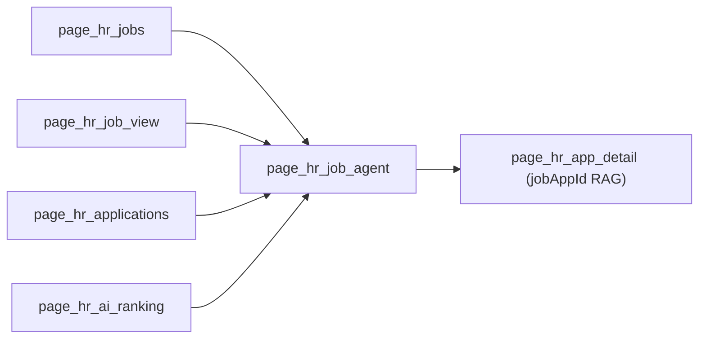

# C3 JobPosting Agent Frontend Design Report

Ngày: 2026-05-29  
Repo: `C:\Users\os\Desktop\cur_prj\miCareer-mini`  
Phạm vi: Thiết kế frontend Streamlit cho FANG C3 JobPosting Agent. Không triển khai code trong task này.

## 1. Executive Recommendation

Khuyến nghị triển khai **một page HR riêng cho JobPosting Agent**, tên đề xuất `page_hr_job_agent`, scope theo `jobPostId`, tách hoàn toàn khỏi chat RAG hiện tại trong `page_hr_app_detail`.

Entry point nên xuất hiện ở:

1. `page_hr_jobs`: mỗi job có nút nhanh `Agent tuyển dụng`.
2. `page_hr_job_view`: cột hành động có nút chính `Hỏi Agent về job này`.
3. `page_hr_applications`: phía trên danh sách ứng viên có nút `Mở Job Agent`.
4. `page_hr_ai_ranking`: thêm nút phụ `Phân tích bằng Agent` để dùng ranking như một workflow liên quan nhưng không nhập chung state.

Lý do chính: JobPosting Agent làm việc trên toàn bộ ứng viên của một tin tuyển dụng (`jobPostId`), còn RAG chat hiện tại làm việc trên một hồ sơ đơn lẻ (`jobAppId`). Nếu nhúng vào trang CV/app detail, UI sẽ dễ gây hiểu nhầm về scope và có nguy cơ dùng nhầm `conversation_id` hiện tại.

Thiết kế page mới nên dùng layout hai cột:

- Cột trái hẹp: danh sách hội thoại, tạo mới, đổi tên, lưu trữ, quick prompts.
- Cột phải rộng: header job context, message stream, tool expanders, working set/source chips, prompt input.

Tier 2 implementation agent có thể bắt đầu sau khi design này được chấp nhận. Backend phase hiện không còn blocker theo smoke report 6/6.

## 2. Current Frontend Architecture Summary

Knowledge graph metadata:

- Project: `miCareer-mini`
- Languages: Python, Markdown, YAML, TOML, config
- Frameworks: Streamlit, Playwright
- Description: thin Streamlit frontend cho HR/candidate recruitment workflows, delegate AI-heavy processing, ranking và chat behavior sang FANG.

Relevant graph layers:

| Layer | Nodes | Implication |
|---|---|---|
| Presentation And Flow | `file:app.py` | Tất cả routing/page state nằm trong một Streamlit entrypoint. |
| Integration Clients | `core/fang_client.py`, `core/nmaiex_client.py`, `core/cloudinary_upload.py` | API wrapper mỏng, không chứa business logic. |
| Data Access | `core/db.py` | Relational reads cho HR jobs, applications, app detail, candidate lookup. |
| Quality And Operations | `test_playwright.py`, config files | Có Playwright smoke cho HR login flow. |

Relevant graph nodes considered:

- `file:app.py`
- `function:app.py:page_hr_jobs`
- `function:app.py:page_hr_job_view`
- `function:app.py:page_hr_applications`
- `function:app.py:page_hr_ai_ranking`
- `function:app.py:_render_hr_ranking_tab`
- `function:app.py:page_hr_app_detail`
- `file:core/fang_client.py`
- `function:core/fang_client.py:chat_query`
- `function:core/fang_client.py:list_conversations`
- `function:core/fang_client.py:get_conversation_messages`
- `file:core/nmaiex_client.py`
- `function:core/nmaiex_client.py:get_candidates_ranking`
- `file:core/db.py`
- `function:core/db.py:get_job_postings_by_company`
- `function:core/db.py:get_job_posting_detail`
- `function:core/db.py:get_applications_for_job`
- `function:core/db.py:get_application_by_job_and_candidate`
- `function:core/db.py:get_application_detail`

Current source findings:

1. `app.py` initializes shared session keys: `current_page`, `hr_user`, `selected_job_id`, `selected_app_id`, `conversation_id`, `hr_ranking_job_id`, `hr_ranking_job_title`.
2. Routing is manual through `go(page)` and `st.session_state.current_page`.
3. HR flow currently includes:
   - `page_hr_jobs`
   - `page_hr_job_view`
   - `page_hr_job_edit`
   - `page_hr_applications`
   - `page_hr_app_detail`
   - `page_hr_ai_ranking`
4. `page_hr_app_detail` owns the existing single-application FANG HR Co-pilot. It uses `selected_app_id`, shared `conversation_id`, `/chat/*` APIs, and exposes `MODEL_MODES`.
5. Ranking exists both as `_render_hr_ranking_tab(job_id)` and duplicated ranking UI inside `page_hr_applications`.
6. `core/fang_client.py` uses `FANG_API_URL` default `http://localhost:8000/v2`, `_post`, `_get`, and current `/chat/*` wrappers.
7. `core/nmaiex_client.py` owns `/nmaiex/*` master/job/ranking wrappers.
8. `core/db.py` can map ranking candidate IDs to `jobAppId` using `get_application_by_job_and_candidate(job_post_id, candidate_id)`.

## 3. Backend API Contract Summary

`FANG_API_URL` already includes `/v2`, so client wrappers must call paths without `/v2`.

### Query

`POST /agent/job-posting/query`

Request:

```json
{
  "jobPostId": 1,
  "hrId": 2,
  "prompt": "Liệt kê top 10 ứng viên phù hợp nhất cho job này",
  "conversationId": null
}
```

Response fields to render:

- `conversationId`
- `messageId`
- `response`
- `model`
- `stepsUsed`
- `toolCalls[]`
- `sourceJobAppIds[]`
- `workingSet`
- `latencyMs`
- `warnings[]`

### Conversation List

`GET /agent/job-posting/conversations?jobPostId=<id>&hrId=<id>`

Render active conversations sorted by backend order, with `title`, `lastMessageAt`, `messageCount`.

### Messages

`GET /agent/job-posting/conversations/<conversationId>/messages?includeToolMessages=true&includeSystem=false`

Render chronological `user`, `assistant`, `tool_call`, `tool_result` messages. Tool rows are debug details, not normal chat bubbles.

### Rename

`PATCH /agent/job-posting/conversations/<conversationId>?hrId=<id>`

Body:

```json
{"title": "Tên hội thoại mới"}
```

### Archive

`DELETE /agent/job-posting/conversations/<conversationId>?hrId=<id>`

Returns `204`.

Backend smoke status from FANG report:

- Health/master data passed.
- Top candidates query passed.
- Multi-turn language filter passed.
- Full CV drill-down with PII masking passed.
- Conversation list/messages passed.
- Cross-tenant authorization negative case passed with `403`.

## 4. Recommended UX Placement and Navigation Flow

### Primary Placement

Add `page_hr_job_agent()` as a dedicated page under HR flow.

Recommended route key:

```text
hr_job_agent
```

Recommended title:

```text
🤖 Job Agent: <job title>
```

Tradeoff:

| Option | Pros | Cons | Decision |
|---|---|---|---|
| Embed in `page_hr_job_view` | Close to job context | Can make job detail too heavy; hard to manage conversation list | Not primary |
| Embed in `page_hr_applications` | Close to application list and ranking | Page already has filters/ranking/list; agent chat will compete for vertical space | Entry point only |
| Add tab shared with applications | Familiar Streamlit pattern | State complexity and duplicated context in a dense page | Acceptable fallback |
| Dedicated `page_hr_job_agent` | Clean `jobPostId` scope, room for conversation management, lowest collision risk | One extra navigation hop | Recommended |

### Navigation

From `page_hr_jobs`:

1. HR clicks `Agent tuyển dụng`.
2. Set:
   - `st.session_state.selected_job_id = jobpostid`
   - `st.session_state.jobposting_agent_job_id = jobpostid`
   - `st.session_state.jobposting_agent_conversation_id = None`
3. `go("hr_job_agent")`

From `page_hr_job_view`:

1. Button in action column.
2. Reuse current `selected_job_id`.
3. Route to `hr_job_agent`.

From `page_hr_applications`:

1. Button near page title.
2. Reuse `selected_job_id`.
3. Route to `hr_job_agent`.

From `page_hr_ai_ranking`:

1. Button `Phân tích bằng Agent`.
2. Set `selected_job_id = hr_ranking_job_id` and route to `hr_job_agent`.
3. Do not copy ranking result state into agent session state; let backend agent own working set through API.

From working set/source chips:

1. When a `jobAppId` chip is clicked, set:
   - `st.session_state.selected_app_id = job_app_id`
   - `st.session_state.conversation_id = None`
2. `go("hr_app_detail")`
3. This intentionally opens the existing single-application detail/RAG page.

## 5. Streamlit Layout Wireframe



```text
page_hr_job_agent
┌──────────────────────────────────────────────────────────────────────────┐
│ ← Back | Job Agent: Senior Backend Engineer                              │
│ Company, expiry, application count                                       │
├──────────────────────────────┬───────────────────────────────────────────┤
│ Left column (25-30%)         │ Right column (70-75%)                     │
│                              │                                           │
│ [New conversation]           │ Chat messages                             │
│ Conversation list            │ - user bubble                             │
│ - title                      │ - assistant bubble                         │
│ - lastMessageAt/messageCount │ - tool_call/tool_result expanders          │
│                              │                                           │
│ Rename field/button          │ Warnings banner                           │
│ Archive button               │ Working set panel                         │
│                              │ Source jobAppId chips                      │
│ Quick prompts                │                                           │
│ - Top 10 candidates          │ st.chat_input / send prompt                │
│ - English Advanced filter    │ Loading spinner while request-response API │
│ - Compare current group      │                                           │
│ - CV masked drill-down       │                                           │
└──────────────────────────────┴───────────────────────────────────────────┘
```

Use Streamlit primitives consistent with current app:

- `st.columns([1, 3])` or `[1, 2.8]`
- `st.container(border=True)` for repeated conversation/working-set panels
- `st.chat_message("user")`, `st.chat_message("assistant")`
- `st.expander(..., expanded=False)` for tool debug
- `st.spinner(...)` for request-response waiting
- `st.button(..., use_container_width=True)` for quick prompts/actions

## 6. Required Changes by File/Function

### `core/fang_client.py`

Add thin wrappers only. Keep all logic in backend/API responses.

Required low-level helper:

- Existing `_post` and `_get` can be reused.
- Add `_patch` and `_delete` or implement minimal direct requests wrappers.
- Prefer surfacing `requests.HTTPError` to UI so status code can be mapped. A later implementation may add a small custom exception with `status_code` and `detail`, but should not add business decisions in the client.

### `app.py`

Add session defaults:

- `jobposting_agent_job_id`
- `jobposting_agent_job_title`
- `jobposting_agent_conversation_id`
- `jobposting_agent_conversations`
- `jobposting_agent_messages`
- `jobposting_agent_working_set`
- `jobposting_agent_source_job_app_ids`
- `jobposting_agent_last_tool_calls`
- `jobposting_agent_warnings`
- `jobposting_agent_error`
- `jobposting_agent_pending_prompt`
- `jobposting_agent_is_loading`

Add functions:

- `page_hr_job_agent()`
- `_render_jobposting_agent_sidebar(job_id, hr_id)`
- `_render_jobposting_agent_messages(messages)`
- `_render_jobposting_agent_tool_message(message_or_tool_call)`
- `_render_jobposting_agent_working_set(working_set, source_job_app_ids)`
- `_jobposting_agent_error_message(exc)`
- `_open_jobposting_agent(job_id, job_title=None)`

Modify functions:

- `page_hr_jobs`: add entry point button.
- `page_hr_job_view`: add action button.
- `page_hr_applications`: add header/action button.
- `page_hr_ai_ranking`: add action button.
- Router: add `elif page == "hr_job_agent"`.

Do not modify behavior of:

- `page_hr_app_detail`
- existing `conversation_id`
- `MODEL_MODES`
- `/chat/*` client wrappers
- ranking result session keys

### `core/db.py`

No required change for Phase FE-1 if clickable source chips only use `jobAppId` directly.

Optional helper for polish:

```python
def get_application_summaries_by_ids(job_app_ids: list[int]) -> list[dict]:
    ...
```

This would let the working-set panel show names/statuses instead of only IDs. Keep it relational and read-only.

### `test_playwright.py`

Optional FE-3 update: add a smoke path that logs in as HR, opens a job, routes to Job Agent, and verifies the prompt input/conversation panel renders. Full agent response testing requires FANG backend running.

## 7. Proposed `core/fang_client.py` Function Signatures

```python
def jobposting_agent_query(
    job_post_id: int,
    hr_id: int,
    prompt: str,
    conversation_id: str | None = None,
) -> dict:
    ...
```

```python
def list_jobposting_agent_conversations(
    job_post_id: int,
    hr_id: int,
) -> list[dict]:
    ...
```

```python
def get_jobposting_agent_messages(
    conversation_id: str,
    include_tool_messages: bool = True,
    include_system: bool = False,
) -> list[dict]:
    ...
```

```python
def rename_jobposting_agent_conversation(
    conversation_id: str,
    hr_id: int,
    title: str,
) -> dict:
    ...
```

```python
def archive_jobposting_agent_conversation(
    conversation_id: str,
    hr_id: int,
) -> None:
    ...
```

Implementation path mapping:

| Function | Method/path |
|---|---|
| `jobposting_agent_query` | `POST /agent/job-posting/query` |
| `list_jobposting_agent_conversations` | `GET /agent/job-posting/conversations` |
| `get_jobposting_agent_messages` | `GET /agent/job-posting/conversations/{id}/messages` |
| `rename_jobposting_agent_conversation` | `PATCH /agent/job-posting/conversations/{id}?hrId=<id>` |
| `archive_jobposting_agent_conversation` | `DELETE /agent/job-posting/conversations/{id}?hrId=<id>` |

## 8. Proposed `st.session_state` Keys

Use `jobposting_agent_` prefix for all new state to avoid collisions with existing `conversation_id` and ranking keys.

| Key | Type | Lifecycle |
|---|---|---|
| `jobposting_agent_job_id` | `int \| None` | Set when opening agent page; mirrors current job scope. |
| `jobposting_agent_job_title` | `str \| None` | Optional cached title for header/sidebar labels. |
| `jobposting_agent_conversation_id` | `str \| None` | Current JobPosting Agent conversation only. Reset on new chat/job switch. |
| `jobposting_agent_conversations` | `list[dict]` | Loaded for current job/hr; refresh after query/rename/archive. |
| `jobposting_agent_messages` | `list[dict]` | Loaded for selected conversation. Clear for new conversation. |
| `jobposting_agent_working_set` | `dict \| None` | Last response working set for compact panel. |
| `jobposting_agent_source_job_app_ids` | `list[int]` | Last response sources for chips. |
| `jobposting_agent_last_tool_calls` | `list[dict]` | Tool calls from current turn for immediate display. |
| `jobposting_agent_warnings` | `list[dict]` | Last response warnings. |
| `jobposting_agent_error` | `str \| None` | Last user-facing error. Clear before new request. |
| `jobposting_agent_is_loading` | `bool` | True during request-response call; disables send/action controls. |
| `jobposting_agent_rename_title` | `str` | Rename input for selected conversation. |

Lifecycle rules:

1. Opening agent from a different `jobPostId` resets `jobposting_agent_conversation_id`, messages, working set, sources, warnings, and errors.
2. Starting a new conversation sets `jobposting_agent_conversation_id = None` and clears message/response state, but keeps job context.
3. Loading an existing conversation updates `jobposting_agent_conversation_id` and replaces messages from backend history.
4. Sending a prompt appends optimistic user UI only inside current render cycle; authoritative history should be reloaded or updated from response after success.
5. Existing `conversation_id` remains reserved for `page_hr_app_detail` jobApp RAG chat and must not be reused.

## 9. Message, Tool, and Working-Set Rendering Rules

### Normal Messages

- `role=user`: render with `st.chat_message("user")`.
- `role=assistant`: render with `st.chat_message("assistant")`; show response markdown, then a compact caption with model/latency when available.
- Empty conversation: show `Hội thoại mới - hãy hỏi về ứng viên của job này.`

### Tool Messages

Render `tool_call` and `tool_result` as collapsed expanders between chat messages or inside a compact `Chi tiết công cụ` block.

Tool display name mapping:

| toolName | Vietnamese display |
|---|---|
| `get_job_posting_context` | Xem thông tin tin tuyển dụng |
| `get_job_candidate_ranking` | Xếp hạng ứng viên |
| `search_job_applications_text` | Tìm kiếm ứng viên |
| `get_job_application_summary` | Tóm tắt ứng viên |
| `get_job_application_full_cv` | Xem CV đã mask PII |
| `get_candidate_ats_history` | Lịch sử tuyển dụng |
| `count_job_applications` | Đếm ứng viên |

Rendering details:

1. Expander title: `Bước <step>: <displayName> - <status>`.
2. Show `latencyMs`, sanitized args, `resultSummary`, and `errorMsg` if any.
3. Parse JSON `content` for history tool rows when possible; if parsing fails, show raw content in `st.code`.
4. Keep expanders collapsed by default.
5. Never render full CV text inside tool debug. Backend should not return raw full CV in tool logs; frontend should still avoid expanding huge payloads blindly.

### Working Set UI

Render after assistant response when `workingSet` exists:

- Label: `workingSet.label` or fallback `Tập ứng viên hiện tại`.
- Count: `len(workingSet.jobAppIds)`.
- Active filters as small markdown/code chips:
  - `language=English`
  - `minLanguageProficiency=ADVANCED`
  - `status=APPLIED`
- JobApp chips:
  - Compact display: `#57`, `#274`, ...
  - Each chip can be a Streamlit button `Xem #57` when rendered in a small grid.
  - Clicking routes to `page_hr_app_detail` with `selected_app_id`.

When more than 25 IDs exist, show first 25 chips plus `+N ứng viên khác`.

### Source Job Applications

Show `sourceJobAppIds` separately from working set:

- Label: `Nguồn được trích dẫn trong câu trả lời`.
- Render chips/buttons using same behavior as working set.
- If source IDs are not in the current working set, still show them because they ground the assistant response.

## 10. Error, Loading, and Empty-State Behavior

### Error Mapping

Map HTTP status to Vietnamese UI messages:

| Status | Message |
|---|---|
| `400` | `Yêu cầu không hợp lệ. Vui lòng kiểm tra nội dung nhập.` |
| `403` | `Bạn không có quyền truy cập tin tuyển dụng hoặc hội thoại này.` |
| `404` | `Không tìm thấy tin tuyển dụng hoặc hội thoại.` |
| `410` | `Hội thoại này đã được lưu trữ. Hãy tạo hội thoại mới.` |
| `429` | `Hệ thống AI đang quá tải. Vui lòng thử lại sau.` |
| `500` | `Lỗi hệ thống khi xử lý Job Agent. Vui lòng thử lại.` |
| `503` | `Dịch vụ AI tạm thời không khả dụng. Vui lòng kiểm tra FANG backend.` |
| timeout/network | `Không kết nối được FANG hoặc yêu cầu quá thời gian chờ.` |

Important: `403` must be shown as access/scope denial, not generic failure.

### Warnings

If response has `warnings[]`, show `st.warning` above or directly under assistant answer.

Suggested formatting:

```text
⚠️ <message>
Gợi ý: <suggestion>
```

Warning types expected:

- `data_quality`
- `too_large_set`
- `max_steps_reached`
- provider/tool warnings

### Loading

Phase 1 is request-response only; no streaming.

Behavior:

1. Disable quick prompt buttons, rename/archive controls, and chat input while request is in flight.
2. Use `st.spinner("FANG Job Agent đang phân tích ứng viên và gọi công cụ...")`.
3. Show a small status text near input: `Có thể mất 10-60 giây tùy số ứng viên và công cụ được gọi.`
4. Do not fake step-by-step streaming. Tool calls become visible after response returns.
5. If client timeout occurs, show timeout error and keep current conversation state unchanged.

### Empty States

No selected job:

- Show error and route back to `hr_jobs`.

No conversations:

- Sidebar: `Chưa có hội thoại cho job này.`
- Main pane: quick prompts and empty chat intro.

Conversation selected but messages fail to load:

- Keep conversation selected.
- Show warning: `Không tải được lịch sử hội thoại.`

No working set:

- Hide working set panel until first response with `workingSet`.

## 11. Quick Prompts

Recommended practical prompts:

1. `Liệt kê top 10 ứng viên phù hợp nhất cho job này, nêu lý do ngắn gọn.`
2. `Trong nhóm này, lọc ứng viên có tiếng Anh Advanced trở lên.`
3. `So sánh 3 ứng viên nổi bật nhất trong nhóm hiện tại.`
4. `Ứng viên nào có kinh nghiệm backend + AI tốt nhất?`
5. `Đếm số ứng viên theo trạng thái tuyển dụng hiện tại.`
6. `Gợi ý shortlist 5 ứng viên nên phỏng vấn trước.`

Avoid prompts that imply bulk full-CV reads for all candidates. For CV drill-down, use a template requiring explicit ID:

```text
Xem chi tiết CV đã mask PII của jobAppId=<id> và tóm tắt điểm mạnh/yếu.
```

## 12. Test Plan

### Backend Prerequisites

FANG backend must run locally with `/v2` enabled:

```powershell
cd C:\Users\os\Desktop\cur_prj\Fang
.\venv\Scripts\python.exe -m uvicorn app.main:app --host 127.0.0.1 --port 8000
```

Frontend env should keep:

```env
FANG_API_URL=http://localhost:8000/v2
```

Do not edit `.env` in implementation unless explicitly requested.

### Streamlit Run Command

```powershell
cd C:\Users\os\Desktop\cur_prj\miCareer-mini
.\venv\Scripts\streamlit.exe run app.py
```

If the local venv command differs, use:

```powershell
python -m streamlit run app.py
```

### Manual Smoke

1. Login as HR.
2. From job list, open `Agent tuyển dụng` for `jobPostId=1`.
3. Verify page title includes job context and conversation list loads.
4. Send top 10 prompt.
5. Verify assistant response, model/latency caption, tool expander, working set, source chips.
6. Send follow-up language filter prompt using same conversation.
7. Verify `conversationId` remains same and working set updates.
8. Click a `jobAppId` source chip and verify navigation to existing `page_hr_app_detail`.
9. Start a new conversation and verify previous state clears.
10. Rename a conversation and verify sidebar title updates.
11. Archive a conversation and verify it disappears from list.
12. Try cross-tenant or invalid IDs only through backend smoke/Postman unless frontend has a safe fixture.

### Browser/Playwright Checks

Manual browser checks are sufficient for FE-1/FE-2.

Playwright becomes useful in FE-3 for:

- route availability after HR login;
- no crash when FANG is down;
- no UI overlap at desktop width;
- prompt input and quick prompt buttons visible;
- conversation list and working set panels render.

### Regression Checks

1. Existing HR job list still opens job detail and application list.
2. Existing `page_hr_app_detail` single-application RAG chat still works with `conversation_id`.
3. Existing ranking flow still works and can navigate to app detail.
4. Candidate apply flow still triggers ingestion.
5. No modelMode selector appears on JobPosting Agent page.

## 13. Implementation Phases

### Phase FE-0: Design Acceptance

- Review this report.
- Confirm dedicated page route `hr_job_agent`.
- Confirm quick prompts and tool display names.
- Confirm no frontend model selector.

### Phase FE-1: API Client + Minimal Page

- Add `core/fang_client.py` wrappers.
- Add session keys.
- Add `page_hr_job_agent` with job header, prompt input, query call, response render.
- Add route and one entry point from `page_hr_job_view`.
- Render warnings and basic errors.

### Phase FE-2: Conversation Management + Tool Expanders

- Add conversation list/load history.
- Add new chat, rename, archive.
- Render `tool_call`/`tool_result` expanders.
- Render working set/source chips and route to app detail.
- Add entry points from jobs/applications/ranking.

### Phase FE-3: Polish + Browser Smoke

- Add compact responsive layout polish.
- Add optional DB helper for jobApp chip names/statuses.
- Add Playwright/manual browser checks.
- Verify no regressions in single-app chat and ranking pages.

## 14. Explicit Non-Goals

1. No backend changes in `Fang`.
2. No `.env` edits.
3. No modification to generated `.understand-anything` graph files.
4. No changes to existing `/chat/*` JobApplication RAG semantics.
5. No model mode selector for JobPosting Agent.
6. No streaming/SSE UI in phase 1.
7. No frontend-side ranking/filtering logic that duplicates FANG agent tools.
8. No bulk full-CV rendering or raw PII display.
9. No removal or refactor of existing ranking pages.
10. No implementation code in this design task.

## 15. Risks and Open Questions

| Risk / Question | Impact | Recommendation |
|---|---|---|
| `page_hr_ai_ranking` exists but current visible entry point appears limited | Feature may be hard to discover | Add route from job list only if product still wants separate ranking page; otherwise keep agent entry independent. |
| `page_hr_applications` duplicates ranking UI with `_render_hr_ranking_tab` logic | Future maintenance cost | Do not refactor during JobPosting Agent FE-1; defer cleanup. |
| Existing shared `conversation_id` is generic | High collision risk with new agent conversations | Use only `jobposting_agent_conversation_id` for new page. |
| Tool message history content may be JSON string | Render can break if parsed naively | Parse defensively, fallback to raw `st.code`. |
| Long agent latency without streaming | HR may think UI is frozen | Strong loading state and disabled controls. |
| Working set chips with many IDs can clutter UI | Poor scanability | Cap visible chips and show count overflow. |
| Backend may return `sourceJobAppIds` without display names | UI is less informative | FE-1 can show IDs; FE-3 can add DB helper for names/status. |

## 16. Files Read

Knowledge graph:

- `C:\Users\os\Desktop\cur_prj\miCareer-mini\.understand-anything\knowledge-graph.json`

Task prompt:

- `C:\Users\os\Desktop\cur_prj\miCareer-mini\agent_workflow_doc\C3_JOBPOSTING_AGENT_FRONTEND_DESIGN_PROMPT.md`

Frontend source:

- `C:\Users\os\Desktop\cur_prj\miCareer-mini\app.py`
- `C:\Users\os\Desktop\cur_prj\miCareer-mini\core\fang_client.py`
- `C:\Users\os\Desktop\cur_prj\miCareer-mini\core\db.py`
- `C:\Users\os\Desktop\cur_prj\miCareer-mini\core\nmaiex_client.py` via targeted symbol search

Backend design/status docs:

- `C:\Users\os\Desktop\cur_prj\Fang\agent_workflow_doc\try_hard_jobposting\FANG_NEXT_PHASE_JOBPOSTING_C3_OFFICIAL_IMPLEMENTATION_PLAN.md`
- `C:\Users\os\Desktop\cur_prj\Fang\agent_workflow_doc\try_hard_jobposting\FANG_NEXT_PHASE_JOBPOSTING_C3_WSD_API_UI_CONTRACT.md`
- `C:\Users\os\Desktop\cur_prj\Fang\agent_workflow_doc\try_hard_jobposting\FANG_NEXT_PHASE_JOBPOSTING_C3_POSTMAN_API_SMOKE_REPORT.md`

## 17. Final Recommendation

Implementation is ready to assign to a tier 2 frontend implementation agent after this design is accepted.

Recommended first implementation target:

1. Add thin client wrappers in `core/fang_client.py`.
2. Add dedicated `page_hr_job_agent`.
3. Add entry point from `page_hr_job_view`.
4. Verify one happy path prompt against local FANG.

Keep the first implementation narrow. Conversation management and polished working-set chips can follow once the minimal page proves the backend integration path in Streamlit.
