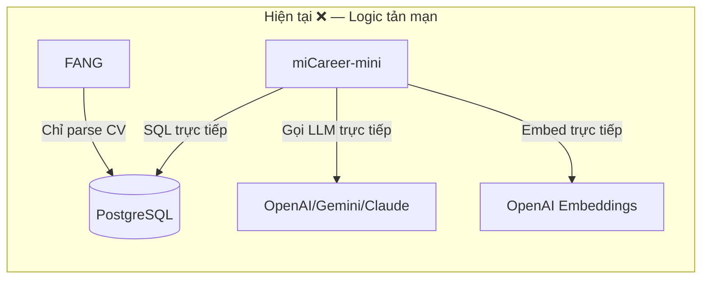
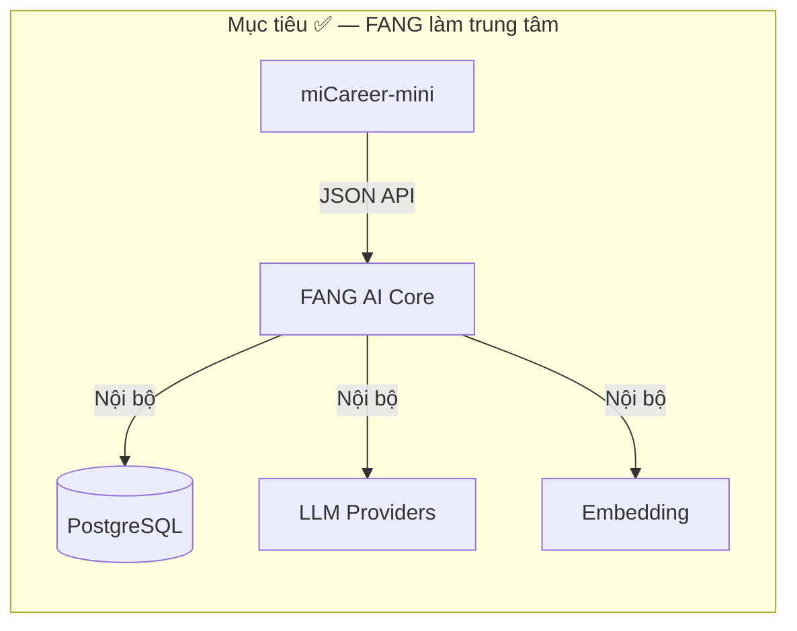
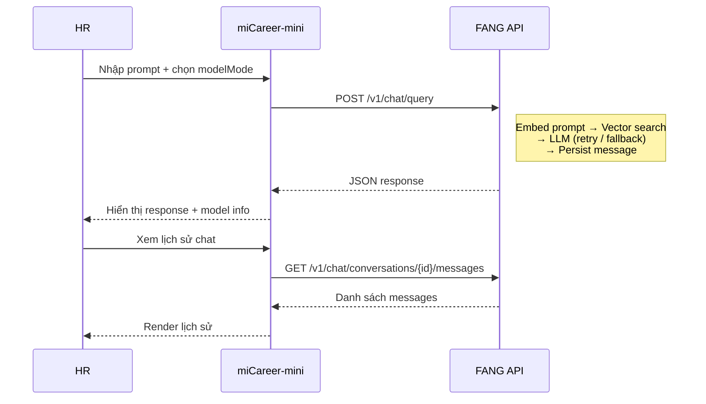
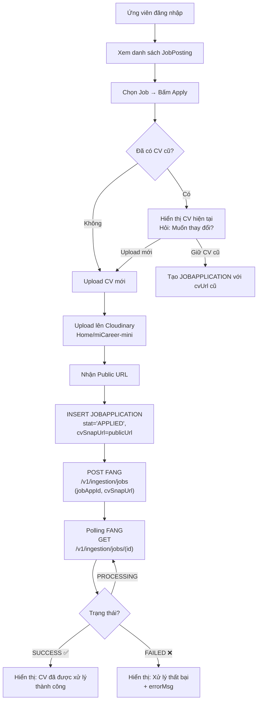
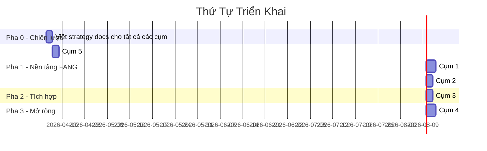

# Kế Hoạch Tổng Quan: Tái Cấu Trúc Kiến Trúc FANG ↔ miCareer-mini

## Bối Cảnh và Phân Tích Hiện Trạng

### Hiện trạng FANG (AI Core)
FANG hiện tại đã hoàn thành **Pha "4.2.1 Xử lý dữ liệu đầu vào"** gồm:
- Pipeline Ingestion E2E: `POST /v1/ingestion/jobs` → Parse → Chunk → Embed → PostgreSQL
- Parser 3-tier (Gemini Flash → GPT-5.4 mini → Claude 4.5 Haiku) với retry/quality gate
- Chunking (Hybrid Structure-aware + Section-Pinning)
- Embedding (`text-embedding-3-small`, `halfvec(1024)`, HNSW cosine)
- Kiểm tra trạng thái: `GET /v1/ingestion/jobs/{id}`

### Hiện trạng miCareer-mini (UI)
miCareer-mini hiện là Streamlit frontend cho HR, **nhưng đang vi phạm kiến trúc ban đầu**:
- **Tự gọi trực tiếp LLM** qua LangChain (`core/ai.py`) — chọn model, tạo prompt, invoke model
- **Tự embed prompt** bằng `OpenAIEmbeddings` riêng biệt
- **Tự truy vấn vector DB** (`core/db.py` → SQL `ORDER BY embedding <=> %s`)
- **Tự quản lý chat history** bằng `st.session_state` (mất khi refresh)
- **Tự log** vào `AIQUERYLOG`
- **Thiếu** luồng ứng viên (candidate login, xem job, apply, upload CV)

### Vấn đề kiến trúc cốt lõi





Sự tách biệt này đảm bảo:
1. **Tích hợp dễ dàng**: Web miCareer gốc (Java Servlet), Spring, hoặc bất kỳ web framework nào — chỉ cần gọi JSON API
2. **Xử lý tập trung**: 5-tier fallback, model resolution, retry, quality gate — tất cả ở FANG
3. **Quản lý thống nhất**: Chat history, logs, bản ghi — tất cả ở FANG

---

## Danh Sách Model Cập Nhật (Tháng 4/2026)

### Bảng resolve model name chính thức

| Tier | Provider | Tên hiển thị | API Model ID | Phân loại |
|------|----------|-------------|-------------|-----------|
| 1 | Google | Gemini Flash Lite | `gemini-3.1-flash-lite-preview` | 💚 Lite |
| 2 | OpenAI | GPT-5.4 mini | `gpt-5.4-mini` | 💚 Lite |
| 3 | Anthropic | Claude 4.5 Haiku | `claude-4.5-haiku` | 💚 Lite |
| 4 | Google | Gemini 3.1 Pro | `gemini-3.1-pro-preview` | 🔶 Pro |
| 5 | OpenAI | GPT-5.4 | `gpt-5.4` | 🔶 Pro |

### Cơ chế Resolve Model Name (pattern đã có từ FANG)

FANG hiện đã có cơ chế `MODEL_CANDIDATES` dict để đối phó việc tên model thay đổi nhanh chóng:

```python
# Mỗi "general name" map sang một danh sách tên cụ thể, thử tuần tự
GEMINI_MODEL_CANDIDATES = {
    "gemini-flash": ["gemini-flash", "gemini-3.1-flash", "gemini-3.1-flash-lite-preview", ...],
    "gemini-pro":   ["gemini-3.1-pro-preview", "gemini-3.1-pro", "gemini-pro"],  # [MỚI]
}
OPENAI_MODEL_CANDIDATES = {
    "gpt-5.4-mini": ["gpt-5.4-mini", "gpt-5-mini"],
    "gpt-5.4":      ["gpt-5.4", "gpt-5.4-pro"],  # [MỚI]
}
ANTHROPIC_MODEL_CANDIDATES = {
    "claude-4.5-haiku": ["claude-4.5-haiku", "claude-3-5-haiku-latest"],
}
```

Gemini còn có thêm `_resolve_gemini_model_name()` — gọi `models.list()` API để lấy danh sách model khả dụng rồi cache kết quả.

**Cơ chế này sẽ được tái sử dụng cho `rag_model_adapters.py`** — các adapter generation cũng dùng chung dict `MODEL_CANDIDATES` và logic resolve.

> [!NOTE]
> `gemini-3-pro-preview` đã deprecated (shutdown 09/03/2026). Phải dùng `gemini-3.1-pro-preview`.
> `GPT-4o` đã retired (03/04/2026). Phải dùng dòng `gpt-5.4`.

---

## Phương Án Làm Việc Tổng Quan

Toàn bộ công việc được chia thành **5 cụm (Cluster)** chính, mỗi cụm sẽ có cặp tài liệu `*_strategy.md` (chiến lược) + `*_guide.md` (hướng dẫn cài đặt) theo chuẩn FANG.

---

### Cụm 1: Mở Rộng FANG — RAG Query API
**Mục tiêu**: FANG nhận prompt từ HR, tự truy xuất vector, gọi LLM, trả JSON kết quả.

#### Phạm vi thay đổi trên FANG
| Thành phần | Thay đổi |
|---|---|
| `schema_ai_core.sql` | Thêm bảng `AICHATCONVERSATION`, `AICHATMESSAGE`. Giữ nguyên `AIQUERYLOG` cho audit |
| `app/core/config.py` | Thêm config cho RAG query: `TOP_K_CHUNKS`, system prompt template, CORS origins |
| `app/models/` | Thêm `chat.py` (request/response models cho RAG query API) |
| `app/services/` | Thêm `rag_query.py` (vector search + prompt embedding + LLM invocation) |
| `app/services/` | Thêm `chat_manager.py` (CRUD conversation/message, context window) |
| `app/services/` | Thêm `rag_model_adapters.py` (5 adapter cho generation, reuse pattern + `MODEL_CANDIDATES` resolve) |
| `app/services/` | Thêm `rag_orchestrator.py` (điều phối auto-lite / auto-pro fallback) |
| `app/api/` | Thêm `routes_chat.py` (endpoint nhận prompt, trả response JSON) |
| `app/main.py` | Mount router mới + CORS middleware |

#### API Contract mới
```
POST /v1/chat/query
Request:
{
    "jobAppId": 123,
    "hrId": 5,
    "prompt": "...",
    "conversationId": null,          // null = tạo mới, uuid = tiếp tục
    "modelMode": "auto-lite"         // Xem bảng modelMode bên dưới
}
Response:
{
    "conversationId": "uuid",
    "messageId": 42,
    "response": "...",
    "model": "google:gemini-3.1-flash-lite-preview",
    "fallbackPath": "tier1:google:gemini-flash(succeeded)",
    "latencyMs": 1200,
    "topK": 3
}

GET /v1/chat/conversations?hrId=5&jobAppId=123
Response: [ { "conversationId": "uuid", "createdAt": "...", "lastMessageAt": "...", "messageCount": 5 } ]

GET /v1/chat/conversations/{conversationId}/messages
Response: [ { "messageId": 42, "role": "user|assistant", "content": "...", "model": "...", "createdAt": "..." } ]
```

#### `modelMode` — 7 lựa chọn cho HR

| modelMode value | Hành vi | Mô tả |
|---|---|---|
| `gemini-flash` | Gọi **chính xác** Gemini Flash Lite, retry bằng tenacity | 💚 Rẻ, nhanh |
| `gpt-mini` | Gọi **chính xác** GPT-5.4 mini, retry bằng tenacity | 💚 Cân bằng |
| `claude-haiku` | Gọi **chính xác** Claude 4.5 Haiku, retry bằng tenacity | 💚 Đọc hiểu tốt |
| `gemini-pro` | Gọi **chính xác** Gemini 3.1 Pro, retry bằng tenacity | 🔶 Phân tích sâu |
| `gpt-full` | Gọi **chính xác** GPT-5.4, retry bằng tenacity | 🔶 Flagship |
| `auto-lite` | 3-tier fallback: Flash → mini → Haiku | 🤖 Tự động (tiết kiệm) |
| `auto-pro` | 2-tier fallback: Gemini Pro → GPT 5.4 | 🤖 Tự động (chất lượng cao) |

**Khi chọn model cụ thể**: FANG chỉ retry bằng tenacity (transient error), **không fallback** sang model khác. Nếu vẫn fail → trả lỗi cho UI.
**Khi chọn auto**: FANG áp dụng fallback chain, bao gồm retry + gate cho generation.

#### Nâng cấp Parser lên 5-Tier

Cập nhật `_default_tiers()` trong `cv_parser.py`:

```python
def _default_tiers() -> tuple[ParserTier, ...]:
    return (
        ParserTier(1, "gemini-flash", GeminiProviderAdapter()),         # Lite
        ParserTier(2, "gpt-5.4-mini", OpenAIProviderAdapter()),         # Lite
        ParserTier(3, "claude-4.5-haiku", AnthropicProviderAdapter()),  # Lite
        ParserTier(4, "gemini-pro", GeminiProviderAdapter()),           # Pro
        ParserTier(5, "gpt-5.4", OpenAIProviderAdapter()),              # Pro
    )
```

> [!WARNING]
> **Cơ chế fallback Lite→Pro (ProTierGate)**: Yếu tố then chốt để fallback lên Pro tier là **chất lượng**, không phải fail hoàn toàn. Nếu 3 Lite tier đều fail hoàn toàn thì khả năng cao là vấn đề hạ tầng — gọi lên Pro lại càng tốn chi phí vô ích. **Cần nghiên cứu kỹ** chính sách quyết định khi nào leo lên Pro. Sẽ phân tích chi tiết trong `rag_query_strategy.md`.

#### Schema mới

```sql
CREATE TABLE AICHATCONVERSATION (
    conversationId UUID PRIMARY KEY DEFAULT gen_random_uuid(),
    jobAppId INT NOT NULL,
    hrId INT NOT NULL,
    createdAt TIMESTAMP NOT NULL DEFAULT CURRENT_TIMESTAMP,
    lastMessageAt TIMESTAMP NOT NULL DEFAULT CURRENT_TIMESTAMP,
    FOREIGN KEY (jobAppId) REFERENCES JOBAPPLICATION(jobAppId),
    FOREIGN KEY (hrId) REFERENCES HR(userId)
);

CREATE TABLE AICHATMESSAGE (
    messageId SERIAL PRIMARY KEY,
    conversationId UUID NOT NULL,
    role VARCHAR(20) NOT NULL,  -- 'user' | 'assistant' | 'system'
    content TEXT NOT NULL,
    model VARCHAR(100),          -- null cho user/system message
    modelMode VARCHAR(50),       -- 'auto-lite' | 'gemini-flash' | v.v.
    topK INT,
    latencyMs INT,
    fallbackPath TEXT,           -- trace path nếu dùng auto mode
    createdAt TIMESTAMP NOT NULL DEFAULT CURRENT_TIMESTAMP,
    FOREIGN KEY (conversationId) REFERENCES AICHATCONVERSATION(conversationId)
);
```

> [!NOTE]
> **Tại sao có `role = 'system'`?**
> Khi context window quá dài, chiến lược Hybrid (Token Budget + Summarization) sẽ dùng LLM tóm tắt phần hội thoại cũ thành 1 message "summary" được persist dưới dạng `role = 'system'`. Điều này giúp FANG khôi phục bối cảnh hội thoại mà không mất thông tin quan trọng. Message system không hiển thị cho HR trên UI.

> [!NOTE]
> Bảng `AIQUERYLOG` được **giữ nguyên** cho mục đích audit/analytics backward-compatible. RAG query mới ghi vào `AICHATMESSAGE`.

#### Tài liệu sẽ tạo cho cụm này
- `FANG/docs/rag_query_strategy.md` — Chiến lược RAG query, 5-tier model, auto mode, context window
- `FANG/docs/rag_query_guide.md` — Hướng dẫn cài đặt module, cấu hình, chạy test

---

### Cụm 2: Quản Lý Hội Thoại Chat (FANG)
**Mục tiêu**: FANG quản lý toàn bộ vòng đời một hội thoại chat.

#### Trách nhiệm
- **Tạo conversation**: Tự động khi HR gửi prompt đầu tiên (`conversationId = null`)
- **Lưu message**: Mỗi cặp user/assistant message được persist vào `AICHATMESSAGE`
- **Truy xuất history**: API trả về lịch sử theo conversation
- **Context window**: Tự cắt/nén history nếu quá dài (token limit) — **🔬 cần nghiên cứu kỹ**
- **Cô lập dữ liệu**: Mỗi conversation gắn chặt với `(jobAppId, hrId)`

#### 3 Vấn Đề Cần Nghiên Cứu Sâu

> [!CAUTION]
> Các vấn đề sau sẽ được phân tích chi tiết trong `rag_query_strategy.md` trước khi implement:
> 
> **🔬 1. ProTierGate Policy** — Khi nào fallback từ Lite lên Pro?
> - Yếu tố chính: **chất lượng output**, không phải failure hoàn toàn
> - Nếu Lite đều fail hạ tầng → Pro cũng sẽ fail, tốn thêm chi phí
> - Cần benchmark + metrics để quyết định ngưỡng
> 
> **🔬 2. Quality Gate cho Generation** — Khác với parser quality gate
> - Parser có deterministic rules (rawText length, section signals, candidate info)
> - Generation output là free-form text → khó đánh giá quality tự động
> - Cần xác định: dùng heuristic hay dùng LLM-as-judge?
> 
> **🔬 3. Context Window Management** — Token budget + Summarization
> - Khi history quá dài: cắt cứng (sliding window) vs tóm tắt (tốn 1 call LLM)
> - Hybrid approach: Token budget → khi chạm ngưỡng → summarize phần cũ → lưu `role='system'`
> - Trade-off: chi phí summarization vs context quality

#### Tài liệu
- Tích hợp vào `FANG/docs/rag_query_strategy.md` mục "Quản lý hội thoại"
- `FANG/docs/rag_query_guide.md` mục "Chat Manager"

---

### Cụm 3: Kiến Trúc Giao Tiếp FANG ↔ UI + CORS
**Mục tiêu**: miCareer-mini chuyển từ "tự xử lý" sang "proxy qua FANG API". FANG hỗ trợ CORS để tích hợp được với mọi loại web client.

#### CORS Middleware
FANG cần thêm CORS middleware vì định hướng là tích hợp vào web thực tế (Java Servlet, Spring Boot, v.v.). miCareer-mini chỉ là UI tạm để dev.

```python
# app/main.py
from fastapi.middleware.cors import CORSMiddleware

app.add_middleware(
    CORSMiddleware,
    allow_origins=settings.cors_allowed_origins,  # Cấu hình qua .env
    allow_methods=["*"],
    allow_headers=["*"],
)
```

#### Thay đổi trên miCareer-mini
| Thành phần | Thay đổi |
|---|---|
| `core/ai.py` | **Xóa toàn bộ** logic LLM/embedding. File này sẽ bị xóa. |
| `core/fang_client.py` | **[NEW]** HTTP client gọi FANG API (chat query + ingestion + status) |
| `core/db.py` | **Giữ lại** các query đọc relational (login, job list, application list). **Xóa** `search_document_chunks`, `log_ai_query` |
| `.env` | Thêm `FANG_API_URL=http://localhost:8000` |
| `app.py` | Chat UI gọi `fang_client`. Selectbox chuyển thành 7 modelMode |

#### Luồng mới


#### Tài liệu
- `FANG/docs/integration_strategy.md` — Kiến trúc giao tiếp, API contract, CORS
- `FANG/docs/integration_guide.md` — Hướng dẫn tích hợp cho mọi loại client

---

### Cụm 4: Luồng Ứng Viên — Apply & Upload CV
**Mục tiêu**: miCareer-mini có thêm role Candidate: xem job → apply → upload CV → trigger FANG parse → theo dõi trạng thái.

#### Luồng end-to-end



#### Thay đổi trên miCareer-mini
| Thành phần | Thay đổi |
|---|---|
| `core/db.py` | Thêm: `get_candidate_user()`, `get_all_job_postings()`, `get_candidate_cv()`, `create_application()` |
| `core/cloudinary_upload.py` | **[NEW]** Upload file PDF lên Cloudinary (folder `Home/miCareer-mini`), trả về public URL |
| `core/fang_client.py` | Thêm function gọi ingestion API + polling status |
| `app.py` | Thêm routing cho candidate: login → jobs → apply → status |
| `.env` | Thêm `CLOUDINARY_CLOUD_NAME`, `CLOUDINARY_API_KEY`, `CLOUDINARY_API_SECRET` |

#### Xử lý trên phía HR
- Khi HR xem chi tiết `JOBAPPLICATION`, hiển thị trạng thái xử lý CV từ `AIINDEXJOB`
- Chỉ cho phép HR prompt chat **khi ingestion đã SUCCESS**
- Nếu đang PROCESSING → hiển thị progress indicator
- Nếu FAILED → hiển thị lỗi, cho phép trigger lại

#### Tài liệu
- `miCareer-mini/docs/candidate_apply_strategy.md` — Chiến lược luồng ứng viên
- `miCareer-mini/docs/candidate_apply_guide.md` — Hướng dẫn cài đặt, kịch bản test

---

### Cụm 5: Model Fallback Tập Trung & Logging (FANG)
**Mục tiêu**: 5-tier model adapters cho cả parse CV và RAG generation, với cơ chế resolve model name chống lỗi thời.

#### Thiết kế 5-Tier Adapters cho Generation

**Tận dụng adapter pattern + MODEL_CANDIDATES đã có** từ `cv_parser_adapters.py`:
- Tạo `rag_model_adapters.py` — 5 adapter, mỗi adapter gọi SDK cho **text generation**
- **Dùng chung `MODEL_CANDIDATES` dict** với parser → khi tên model đổi chỉ cần sửa 1 nơi
- Interface: `generate(messages: list, system_prompt: str) -> (response_text, resolved_model)`
- Resolve model name: reuse `_resolve_gemini_model_name()` (cache + listing API), OpenAI/Anthropic dùng candidate loop + `_is_model_not_found_error()`

**Orchestrator cho auto mode:**
- `rag_orchestrator.py` reuse concept `CVParserOrchestrator`:
  - `auto-lite`: Fallback chain Tier 1 → 2 → 3 (3 model Lite)
  - `auto-pro`: Fallback chain Tier 4 → 5 (2 model Pro)

**Khi HR chọn model cụ thể:**
- Chỉ gọi đúng 1 adapter, retry bằng tenacity (transient errors)
- Không fallback → fail = trả lỗi

**Logging tập trung:**
- `modelVer`: format `provider:resolved_model` (giống `parserVer`)
- `fallbackPath`, `latencyMs`, `fallbackReason`
- Ghi vào `AICHATMESSAGE` + `AIQUERYLOG` (audit)

#### Nâng cấp Parser 3→5 Tier
- Thêm 2 tier Pro vào `_default_tiers()` và mở rộng `MODEL_CANDIDATES`
- **ProTierGate policy** — 🔬 cần nghiên cứu kỹ (xem mục "3 Vấn Đề Cần Nghiên Cứu Sâu")
- Cập nhật unit tests để cover 5-tier path

#### Tài liệu
- Tích hợp vào `FANG/docs/rag_query_strategy.md`
- `FANG/docs/rag_query_guide.md`

---

## Thứ Tự Triển Khai



**Pha 0**: Viết kỹ strategy docs trước khi code
**Pha 1** (Cụm 5 → 1 → 2): FANG hoàn chỉnh
**Pha 2** (Cụm 3): miCareer-mini → FANG client
**Pha 3** (Cụm 4): Luồng candidate E2E

---

## Quy Chuẩn Làm Việc

### Branching Strategy
```
main ─────────────────────────── (nhánh sản phẩm)
  └── develop ────────────────── (nhánh phát triển)
        ├── feature/fang-5tier-model-adapters
        ├── feature/fang-rag-query-api
        ├── feature/fang-chat-manager
        ├── feature/mini-fang-integration
        └── feature/mini-candidate-apply
```

### Commit Convention
- Ngôn ngữ: **Tiếng Việt**, thuật ngữ chuyên ngành giữ **tiếng Anh**
- Format: `<loại>: <mô tả ngắn gọn>`
- Ví dụ:
  - `feat: thêm endpoint POST /v1/chat/query cho RAG query`
  - `schema: tạo bảng AICHATCONVERSATION và AICHATMESSAGE`
  - `refactor: nâng parser từ 3-tier lên 5-tier`
  - `docs: viết chiến lược RAG query 5-tier (rag_query_strategy.md)`
  - `fix: sửa lỗi type mismatch khi cast halfvec`
  - `test: bổ sung smoke test cho chat API`

### Tổ chức thư mục Test (theo chuẩn FANG)
```
project/
├── smoke_tests/          # Integration test thật (gọi API thật, DB thật)
│   ├── test_parser.py
│   ├── test_e2e_pipeline.py
│   └── test_chat_api.py        # [NEW]
├── tests/
│   └── unit/             # Unit test (mock, isolated)
│       ├── unit_test_parser_policy.py
│       ├── unit_test_rag_orchestrator.py  # [NEW]
│       └── unit_test_chat_manager.py      # [NEW]
└── test_api.http         # REST Client requests
```

### Quy trình tài liệu
Mỗi cụm có cặp (tham khảo mẫu: `chunking_strategy.md` + `chunking_guide.md`):
1. **`*_strategy.md`** — Chiến lược: Lý thuyết, quyết định kiến trúc, đánh đổi, diagram
2. **`*_guide.md`** — Hướng dẫn: Workflow code, config, cách test, edge cases

---

## Tổng kết các quyết định

| # | Quyết định | Kết luận |
|---|---|---|
| 1 | Giữ/bỏ `AIQUERYLOG` | ✅ Giữ cho audit, RAG mới ghi `AICHATMESSAGE` |
| 2 | SelectBox model ở UI | ✅ 7 lựa chọn: 5 model cụ thể + auto-lite + auto-pro |
| 3 | Embedding prompt ở đâu | ✅ FANG tự embed, dùng `embedding.py` đã có |
| 4 | CORS | ✅ Thêm CORS middleware, phục vụ mọi loại web client |
| 5 | Parser tiers | ✅ Nâng 3→5 tier |
| 6 | ProTierGate policy | 🔬 Cần nghiên cứu — yếu tố chất lượng, không phải failure |
| 7 | Quality gate generation | 🔬 Cần nghiên cứu — khác parser, output là free-form text |
| 8 | Context window | 🔬 Cần nghiên cứu — Hybrid token budget + summarization |
| 9 | Role system trong message | ✅ Dùng cho context summarization khi hội thoại quá dài |
| 10 | Resolve model name | ✅ Reuse `MODEL_CANDIDATES` dict + resolve pattern đã có |
