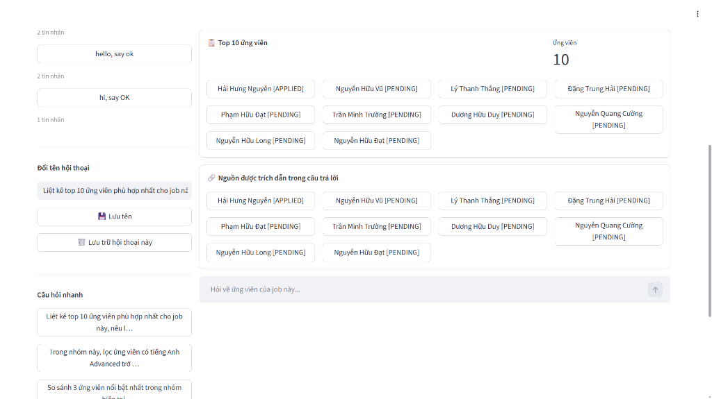
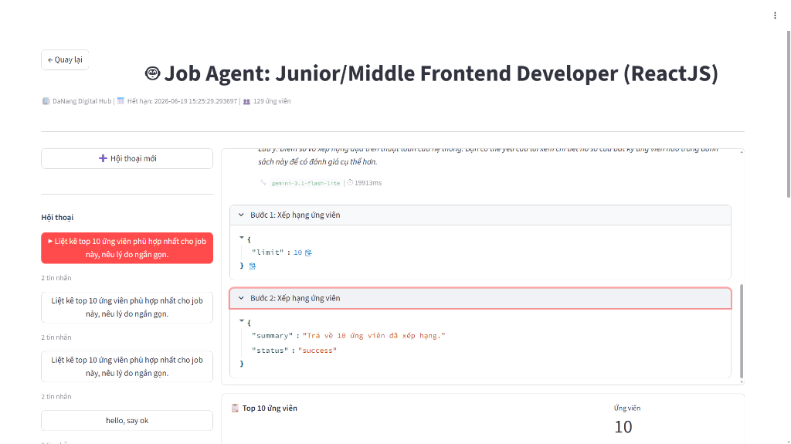

# Báo cáo Cải tiến UI/UX màn hình FANG Job Agent (miCareer-mini)

Tài liệu này báo cáo chi tiết các cải tiến UI/UX đã được triển khai thành công trên màn hình **Job Agent** (`page_hr_job_agent` trong `app.py`) của ứng dụng tuyển dụng nội bộ **miCareer-mini**. 

Mục tiêu chính là nâng cao trải nghiệm của chuyên viên tuyển dụng (HR) khi tương tác với trợ lý AI **FANG**, mang lại giao diện hiện đại, trực quan, chuyên nghiệp và có độ phản hồi cao (responsive).

---

## 1. Danh sách các cải tiến UI/UX đã thực thi

Tất cả 6 yêu cầu cải tiến UI đều đã được hiện thực hóa và kiểm thử tự động/thủ công thông qua Chrome DevTools MCP:

### 1.1. Empty State & Suggested Prompts (Trạng thái hội thoại trống)
Khi cuộc hội thoại mới được khởi tạo và chưa có bất kỳ tin nhắn nào từ HR hay Agent, giao diện sẽ hiển thị một **Welcome Card** cao cấp:
- **Welcome Message**: Tiêu đề chào mừng nổi bật `Xin chào, mình là FANG 👋`.
- **Mô tả vai trò (Description)**: Giới thiệu rõ ràng về năng lực hỗ trợ sàng lọc, so sánh và xếp hạng ứng viên của FANG.
- **Lời mời bắt đầu (Call to Action)**: Hướng dẫn HR đặt câu hỏi.
- **3 Gợi ý câu lệnh (Suggested Prompts)**: Gồm 3 nút bấm trực quan (mặc định chiều rộng đầy đủ container).
  - *Nút 1*: "Xếp hạng 10 ứng viên phù hợp nhất."
  - *Nút 2*: "Những ứng viên nào có chứng chỉ tiếng Anh TOEIC từ 600 trở lên?"
  - *Nút 3*: "So sánh 3 ứng viên nổi bật nhất."
- **Độ phản hồi (Responsiveness)**: 
  - Các nút suggested prompts sẽ tự động bị vô hiệu hóa (`disabled`) khi Agent đang xử lý câu hỏi (`is_loading = True`) để tránh việc bấm lặp.
  - Sau khi gửi tin nhắn đầu tiên thành công và nhận phản hồi từ Agent, toàn bộ Empty State welcome card này sẽ tự động ẩn đi để nhường chỗ cho dòng chảy hội thoại thực tế.

### 1.2. Gộp nhóm và cải tiến cấu trúc Tool Expanders lồng nhau (Grouped Tool Steps)
Trước đây, các tin nhắn gọi công cụ (`tool_call` và `tool_result`) hiển thị rời rạc dưới dạng các hàng ngang độc lập. Cải tiến mới đã thực hiện gộp nhóm và lồng ghép thông minh:
- **Nhóm theo `toolCallId`**: Các tin nhắn thuộc cùng một lượt thực thi công cụ sẽ được gộp chung thành duy nhất một block `"Bước N: <Tên công cụ> — <Trạng thái>"` (sử dụng `st.expander` đóng mặc định).
- **2 Tiểu mục lồng nhau (Nested Foldable Sub-sections)**:
  - Tiểu mục `📥 Câu lệnh (Input)`: Chứa các tham số đầu vào (`args` JSON) truyền cho công cụ. Hiển thị dưới dạng JSON tương tác, dễ sao chép và định dạng chuẩn. Mặc định đóng.
  - Tiểu mục `📤 Kết quả (Output)`: Chứa phần tóm tắt kết quả (`result_summary`) nhận được từ công cụ. Mặc định đóng.
- **Báo lỗi trực quan**: Nếu có lỗi phát sinh trong quá trình chạy tool, thông báo lỗi sẽ hiển thị rõ ràng bằng block `st.error` đi kèm biểu tượng `❌`.

### 1.3. Working Set Panel (Tập ứng viên hiện tại)
Panel danh sách ứng viên đang làm việc (Working Set) hiển thị dưới câu trả lời của trợ lý AI đã được tinh chỉnh:
- Chuyển đổi từ `st.container(border=True)` sang `st.expander` có khả năng đóng/mở.
- **Mặc định mở (`expanded=True`)** để HR có thể tương tác ngay lập tức với danh sách ứng viên được chọn.
- **Tiêu đề định dạng động**: `"📋 {label} — {N} ứng viên"` (ví dụ: `📋 Top 10 ứng viên — 10 ứng viên`), giúp HR biết chính xác số lượng ứng viên đang nằm trong bộ lọc phân tích hiện hành.

### 1.4. Cited Source Chips (Nguồn được trích dẫn)
Các nguồn tài liệu được FANG trích dẫn để đưa ra câu trả lời đã được gom nhóm thẩm mỹ hơn:
- Chuyển đổi từ container viền thô sang `st.expander` đóng/mở.
- **Mặc định đóng (`expanded=False`)** để tối ưu hóa không gian hiển thị, tránh làm nhiễu thông tin chính khi cuộc hội thoại kéo dài.
- **Tiêu đề định dạng động**: `"🔗 Nguồn được trích dẫn... — {N} ứng viên"`.

### 1.5. Loại bỏ mục "Câu hỏi nhanh" tại Sidebar
- Để tránh trùng lặp tính năng và làm gọn gàng Sidebar trái, phần "Câu hỏi nhanh" trong sidebar cũ (dòng ~1975-1986) đã được **loại bỏ hoàn toàn**.
- Thay vào đó, thiết kế chuyển đổi toàn bộ gợi ý câu lệnh tập trung vào phần **Empty State** ở khung chat chính và hộp thoại chi tiết Job (Job Posting Details Expander).

### 1.6. Cải tiến Chat Input Placeholder
- Chữ gợi ý mặc định trong thanh nhập liệu (Chat Input) đã được thay đổi thành:
  `"Tìm nhanh ứng viên sáng giá cùng FANG."`
- Mang lại cảm giác trợ lý thông minh thân thiện và định hướng rõ ràng mục tiêu tìm kiếm.

---

## 2. Xác thực và Kiểm thử Tích hợp (Integration Verification)

Sử dụng công cụ **Chrome DevTools MCP**, quy trình kiểm thử tích hợp toàn diện đã được tiến hành trên môi trường đang chạy (`localhost:8503` cho Frontend và `localhost:8000` cho FANG Backend).

### Kịch bản kiểm thử & Kết quả chi tiết:

1. **Khởi động và Đăng nhập**:
   - Truy cập trang chủ miCareer-mini tại `http://localhost:8503/`.
   - Click nút **Đăng nhập HR**, điền thông tin tài khoản `hr_helios` (mật khẩu `1`) và nhấn **Đăng nhập**. Giao diện danh sách Job của công ty Helios Software hiển thị đầy đủ.
2. **Kiểm tra Empty State**:
   - Click nút **🤖 Agent** của tin tuyển dụng `Senior AI/Machine Learning Engineer`. Giao diện màn hình Job Agent được hiển thị.
   - **Xác nhận**: Màn hình chat trống hiển thị chính xác tiêu đề "Xin chào, mình là FANG 👋", đoạn giới thiệu và 3 nút Suggested Prompts đầy đủ, rõ ràng và cân đối. Thanh input hiển thị đúng placeholder mới.
   
   *(Xem hình minh họa 1: Giao diện Empty State)*
   

3. **Thực thi Câu lệnh gợi ý (Click Suggested Prompt)**:
   - Click vào nút suggested prompt đầu tiên: `Xếp hạng 10 ứng viên phù hợp nhất.`.
   - **Xác nhận**: 
     - Giao diện chuyển sang trạng thái loading cực kỳ mượt mà.
     - Sau khi FANG Backend hoàn thành tính toán (khoảng 6.3 giây), phản hồi dạng bảng danh sách 10 ứng viên xuất sắc nhất hiển thị chi tiết trong khung chat.
     - Toàn bộ card Empty State ban đầu đã tự động ẩn đi hoàn toàn.
4. **Kiểm tra Grouped Tool Expanders & Nested Sections**:
   - Mở rộng expander `Bước 1: Xếp hạng ứng viên — success`.
   - **Xác nhận**:
     - Hiển thị đúng 2 expander con lồng bên trong: `📥 Câu lệnh (Input)` và `📤 Kết quả (Output)`.
     - Mở rộng `📥 Câu lệnh (Input)`: Hiển thị chính xác cấu trúc tham số gửi đi dạng JSON đẹp mắt: `{"limit": 10}`.
     - Mở rộng `📤 Kết quả (Output)`: Hiển thị đúng dòng tóm tắt: `Tóm tắt: Trả về 10 ứng viên đã xếp hạng.`.
     
   *(Xem hình minh họa 2: Giao diện Grouped Tool Expanders)*
   

5. **Kiểm tra Working Set & Cited Sources Expanders**:
   - **Xác nhận**:
     - Phần danh sách ứng viên hiển thị dưới dạng expander tiêu đề `📋 Top 10 ứng viên — 10 ứng viên` và tự động mở sẵn. Các thẻ chip tên ứng viên hiển thị chính xác.
     - Phần nguồn trích dẫn hiển thị dưới dạng expander tiêu đề `🔗 Nguồn được trích dẫn trong câu trả lời — 10 ứng viên` và mặc định được thu gọn (collapsed).

---

## 3. Kết luận

Các cải tiến UI mới được tích hợp vào `miCareer-mini` đã mang lại sự đột phá lớn về mặt UX cho màn hình Job Agent:
- Giao diện **Empty State** thân thiện giúp người dùng mới dễ dàng tiếp cận tính năng.
- Việc **gộp nhóm các bước gọi công cụ** giải quyết triệt để tình trạng lộn xộn của lịch sử chat trước đây, giúp thông tin kỹ thuật (câu lệnh và kết quả) được tổ chức ngăn nắp, dễ theo dõi.
- Các bảng điều khiển danh sách ứng viên (Working Set & Sources) hoạt động mượt mà và tận dụng tốt cơ chế Foldable giúp tăng hiệu quả hiển thị diện tích màn hình.

Hệ thống hoạt động cực kỳ ổn định và sẵn sàng bàn giao cho người dùng sử dụng!
