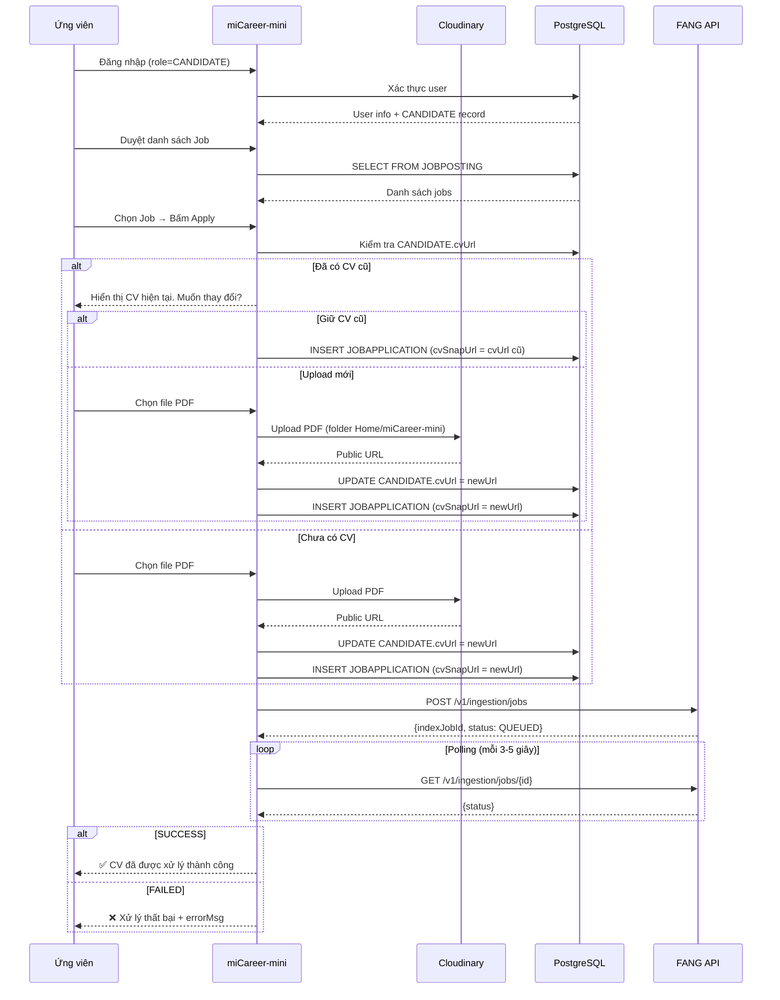
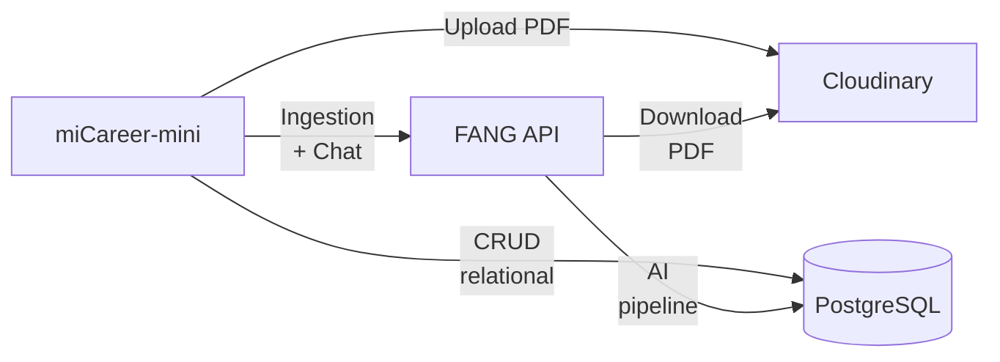

# Chiến Lược Luồng Ứng Viên — Apply & Upload CV

Tài liệu này định nghĩa kiến trúc cho luồng ứng viên (Candidate) trong miCareer-mini: từ đăng nhập, duyệt tin tuyển dụng, ứng tuyển kèm upload CV, đến theo dõi trạng thái xử lý. Luồng này bổ sung cho hệ thống hiện chỉ có phía HR.

> [!NOTE]
> API contract đầy đủ của FANG v2 xem tại: `FANG/docs/integration_strategy.md`

## 1. Nguyên Tắc Cốt Lõi

* **Upload trực tiếp Cloudinary**: miCareer-mini xử lý upload CV lên Cloudinary (folder `Home/miCareer-mini`). Không qua FANG cho việc upload — FANG chỉ nhận URL đã public.
* **Delegate xử lý AI cho FANG**: Sau khi có URL Cloudinary, miCareer-mini gọi FANG `POST /v1/ingestion/jobs` để trigger pipeline Parse→Chunk→Embed.
* **Polling trạng thái**: miCareer-mini liên tục hỏi FANG `GET /v1/ingestion/jobs/{id}` cho đến khi hoàn thành (SUCCESS hoặc FAILED).
* **CV cũ được bảo toàn**: Nếu ứng viên đã có CV trước đó (trong bảng `CANDIDATE.cvUrl`), hệ thống hiển thị CV hiện tại và hỏi ứng viên có muốn thay đổi không.

## 2. Kiến Trúc Tổng Quan



## 3. Xác Thực Đa Vai Trò (Multi-Role Login)

### Hiện trạng
miCareer-mini hiện chỉ hỗ trợ login HR (kiểm tra `role = 'HR'` trong bảng `user`).

### Mở rộng
Thêm login Candidate bằng cách kiểm tra `role = 'CANDIDATE'`:

```python
# Login phân nhánh theo role
def login(username, password):
    user = db.get_user(username, password)
    if user['role'] == 'HR':
        return redirect_to('hr_dashboard')
    elif user['role'] == 'CANDIDATE':
        return redirect_to('candidate_jobs')
```

Routing trang:
| Role | Entry page | Luồng |
|---|---|---|
| HR | `page_jobs` | Jobs → Applications → RAG Workspace |
| CANDIDATE | `page_candidate_jobs` | Browse Jobs → Apply → Status |

## 4. Cloudinary Upload

### 4.1 Cấu hình

```
CLOUDINARY_CLOUD_NAME=dfwkw1guc
CLOUDINARY_API_KEY=...
CLOUDINARY_API_SECRET=...
CLOUDINARY_UPLOAD_FOLDER=Home/miCareer-mini
```

### 4.2 Module `core/cloudinary_upload.py`

```python
import cloudinary
import cloudinary.uploader

def upload_cv(file_bytes: bytes, filename: str) -> str:
    """Upload CV PDF lên Cloudinary, trả về public URL."""
    
    cloudinary.config(
        cloud_name=os.getenv("CLOUDINARY_CLOUD_NAME"),
        api_key=os.getenv("CLOUDINARY_API_KEY"),
        api_secret=os.getenv("CLOUDINARY_API_SECRET"),
    )
    
    result = cloudinary.uploader.upload(
        file_bytes,
        folder=os.getenv("CLOUDINARY_UPLOAD_FOLDER", "Home/miCareer-mini"),
        resource_type="raw",      # PDF không phải image
        public_id=filename,       # Tên file trên Cloudinary
        overwrite=True,
    )
    
    return result["secure_url"]
```

### 4.3 Lưu ý
- **`resource_type="raw"`**: PDF phải upload dưới dạng raw, không phải image
- **Folder `Home/miCareer-mini`**: Đã có sẵn trên Cloudinary, dễ quản lý
- **URL public**: URL Cloudinary trả về là public, FANG có thể download trực tiếp qua `cv_loader.py`

## 5. Tạo Bản Ghi Application

Sau khi có CV URL (cũ hoặc mới upload):

```python
def create_application(candidate_id: int, job_post_id: int, cv_snap_url: str) -> int:
    """INSERT JOBAPPLICATION, trả về jobAppId."""
    query = """
        INSERT INTO JOBAPPLICATION (candidateId, jobPostId, stat, cvSnapUrl)
        VALUES (%s, %s, 'APPLIED', %s)
        RETURNING jobAppId
    """
    # ...
```

### Các cột quan trọng
- `stat = 'APPLIED'` — trạng thái ban đầu
- `cvSnapUrl` — URL Cloudinary (snapshot tại thời điểm apply, immutable)
- `candidateId`, `jobPostId` — khóa ngoại

### Tại sao dùng `cvSnapUrl` thay vì `CANDIDATE.cvUrl`?
`CANDIDATE.cvUrl` là CV mới nhất của ứng viên (có thể thay đổi sau). `JOBAPPLICATION.cvSnapUrl` là snapshot CV tại thời điểm apply — đảm bảo HR luôn nhìn thấy đúng phiên bản CV mà ứng viên đã nộp.

## 6. Trigger FANG Ingestion

Sau khi `INSERT JOBAPPLICATION` thành công:

```python
# core/fang_client.py
import httpx
import os

FANG_URL = os.getenv("FANG_API_URL", "http://localhost:8000")

def trigger_ingestion(job_app_id: int, cv_snap_url: str) -> dict:
    """Gọi FANG v2 để trigger parse→chunk→embed."""
    response = httpx.post(
        f"{FANG_URL}/v2/ingestion/jobs",
        json={"jobAppId": job_app_id, "cvSnapUrl": cv_snap_url},
        timeout=10,
    )
    response.raise_for_status()
    return response.json()  # {"indexJobId": 1, "status": "QUEUED"}


def get_ingestion_status(index_job_id: int) -> dict:
    """Polling trạng thái ingestion."""
    response = httpx.get(
        f"{FANG_URL}/v2/ingestion/jobs/{index_job_id}",
        timeout=10,
    )
    response.raise_for_status()
    return response.json()  # {"status": "...", "errorMsg": "..."}
```

## 7. Polling Trạng Thái

### Chiến lược Polling từ UI

Streamlit không hỗ trợ WebSocket native. Dùng polling interval:

```python
import time
import streamlit as st

def poll_ingestion(index_job_id: int):
    """Polling loop hiển thị trạng thái cho ứng viên."""
    status_placeholder = st.empty()
    
    while True:
        result = fang_client.get_ingestion_status(index_job_id)
        status = result["status"]
        
        if status == "SUCCESS":
            status_placeholder.success("✅ CV đã được xử lý thành công!")
            break
        elif status == "FAILED":
            status_placeholder.error(f"❌ Xử lý thất bại: {result.get('errorMsg', 'Unknown')}")
            break
        else:
            status_placeholder.info(f"⏳ Đang xử lý... ({status})")
            time.sleep(3)  # Poll mỗi 3 giây
```

### Timeout
- Polling tối đa 5 phút (100 lần × 3 giây)
- Nếu quá timeout → hiển thị cảnh báo, cho phép ứng viên quay lại sau

## 8. Phía HR — Xem Trạng Thái CV Processing

Khi HR xem chi tiết một `JOBAPPLICATION`:

```python
def get_ingestion_status_for_app(job_app_id: int) -> dict | None:
    """Lấy trạng thái ingestion mới nhất cho một application."""
    query = """
        SELECT indexJobId, stat, errorMsg
        FROM AIINDEXJOB
        WHERE jobAppId = %s
        ORDER BY createdAt DESC
        LIMIT 1
    """
    # ...
```

### Logic hiển thị cho HR
| Trạng thái | Hiển thị | Cho phép Chat? |
|---|---|---|
| Chưa có AIINDEXJOB | ⚠️ CV chưa được xử lý | ❌ |
| QUEUED | 🕐 Đang chờ xử lý | ❌ |
| PROCESSING | ⏳ Đang parse/chunk/embed | ❌ |
| SUCCESS | ✅ Sẵn sàng | ✅ Chat được |
| FAILED | ❌ Lỗi: {errorMsg}. [Thử lại] | ❌ |

**Quan trọng**: HR **chỉ được prompt chat khi ingestion đã SUCCESS**. Nếu chưa có vector data → chat sẽ trả kết quả vô nghĩa.

## 9. Xử Lý Ngoại Lệ (Edge Cases)

### 9.1 Ứng viên apply cùng Job nhiều lần
- Schema hiện tại **không có** UNIQUE constraint trên `(candidateId, jobPostId)`
- Mỗi lần apply tạo 1 bản ghi `JOBAPPLICATION` mới với `cvSnapUrl` riêng
- HR nhìn thấy nhiều application từ cùng ứng viên → đánh giá từng version

### 9.2 Upload CV fail
- Cloudinary timeout / rate limit → hiển thị lỗi, cho retry
- File quá lớn (>10MB) → validate trước khi upload
- File không phải PDF → validate MIME type

### 9.3 FANG không khả dụng
- Ingestion request fail → lưu application vẫn thành công, nhưng trạng thái processing = "chưa xử lý"
- HR thấy ⚠️ và có thể trigger lại sau khi FANG khôi phục

### 9.4 CV format dị biệt
- FANG parser đã có 5-tier fallback + quality gate → xử lý tốt hầu hết format
- Nếu cả 5 tier fail → ingestion status = FAILED → HR/ứng viên biết

## 10. Tóm Tắt Dependencies



| Dependency | Mục đích | Cần thiết khi |
|---|---|---|
| Cloudinary | Lưu trữ CV PDF | Candidate upload CV |
| PostgreSQL | Dữ liệu relational | Mọi lúc |
| FANG API | AI processing + Chat | Ingestion + HR chat |

## 11. Tài Liệu Liên Quan

- `FANG/docs/integration_strategy.md` — **API contract đầy đủ của FANG v2** (các endpoint, request/response format, CORS)
- `FANG/docs/rag_query_strategy.md` — Chiến lược RAG query (phía HR chat sau khi ingestion SUCCESS)
- `docs/hr_guide.md` — Luồng HR hiện tại (đang nắm trong archive, cập nhật sau)
