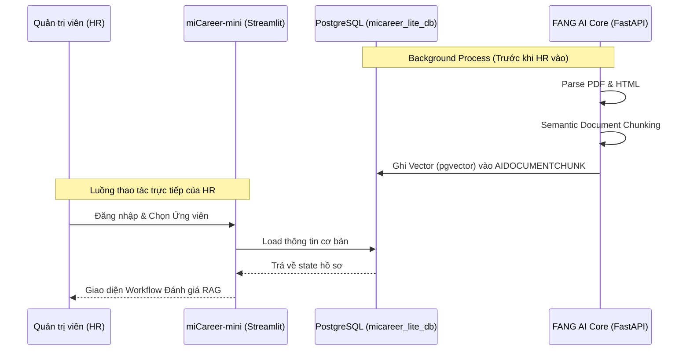

# Chiến Lược Retrieval-Augmented Generation (RAG) (Frontend - Pha Tích Hợp)

Tài liệu này định nghĩa kiến trúc **"Direct-DB Retrieval"** cho quy trình truy vấn và sinh câu trả lời trong dự án `miCareer-mini`, đóng vai trò là lớp Frontend tương tác với AI Core của FANG.

Kiến trúc này chủ trương tận dụng tối đa cơ sở hạ tầng có sẵn (PostgreSQL `pgvector`) và lược bỏ các vector database trung gian để đạt độ trễ thấp và sự đồng bộ tuyệt đối với Pipeline Ingestion của FANG.

## 1. Tương tác hệ thống (miCareer-mini & FANG AI Core)



## 2. Đường ống RAG Pipeline nội bộ (Direct-DB Retrieval)

Thay vì dùng database vector cồng kềnh ngoài, `miCareer-mini` trực tiếp kết nối DB và sử dụng phép toán `<=>` (Khoảng cách Cosine) của pgvector:

```mermaid
flowchart TD
    A[HR Nhập Prompt] --> B{Streamlit State}
    B --> C[Module Tích hợp LangChain]
    C -->|text-embedding-3-small| D[Vectorized Prompt (1024_d)]
    
    D --> E[(PostgreSQL pgvector)]
    E -->|Pre-filter jobAppId| F[B-Tree Indexing]
    F -->|Cosine Distance <=>| G[Khớp 3 Target Chunks tốt nhất]
    
    G --> H[Ghép Context + Lịch sử Chat]
    H --> I{Chọn LLM Model}
    I -->|Tier 1| J(Gemini Flash)
    I -->|Tier 2| K(GPT-5.4 mini)
    I -->|Tier 3| L(Claude 4.5 Haiku)
    
    J & K & L --> M[Sinh Phản Hồi]
    M --> N[Lưu AIQUERYLOG]
    N --> O[Hiển thị kết quả cho HR]
```

## 3. Nguyên Tắc Cốt Lõi
* **Bám sát Hệ sinh thái FANG:** Không xây dựng lại các tính năng mà FANG đã phát triển (Parser, Embedder). Hệ thống chỉ thực thi truy xuất và tạo sinh dựa trên tài nguyên của FANG.
* **Direct Database Vector Search:** Sử dụng toán tử Cosine Similarity (`<=>`) của pgvector để tính khoảng cách ngay tại tầng SQL, xử lý logic tối ưu hiệu năng ngay trên Memory của PostgreSQL thay vì query ra Python.
* **Tối Ưu Token Cost Đa Tầng:** Áp dụng hệ thống phân bậc cấu trúc mô hình (Multi-Tier LLM Architecture) để cân đối khéo léo giữa chi phí, tốc độ phản hồi và độ khó của câu hỏi nhân sự.
* **Stateful Chat Memory:** Giữ nguyên được bối cảnh trò chuyện (Context) cho HR mà không can thiệp liên tục vào Read/Write Log CSDL bằng cách áp dụng lưu trữ In-memory thông minh.

## 2. Pipeline Truy Xuất Sinh Tự Động (RAG Pipeline)

### Bước 2.1: Mã hóa Yêu cầu (Prompt Embedding)
Hệ thống sử dụng cơ chế nhúng thời gian thực. Khi HR nhập vào câu lệnh (Ví dụ: "Hãy tổng hợp lại kinh nghiệm ứng dụng RAG của bạn này"), `miCareer-mini` sẽ:
1. Gửi chuỗi text thô lên API nhúng `text-embedding-3-small` để chuyển hóa câu lệnh của HR thành vector 1024 chiều.
2. Truy xuất bắt buộc áp dụng **Strict Type Casting** ép kiểu về `halfvec` (Lượng tử hóa vô hướng của FANG) khi giao tiếp với cấu trúc schema có sẵn để PostgreSQL không bị lỗi type-mismatch.

### Bước 2.2: K-Nearest Neighbors Retrieval
Khối vector sinh ra sẽ được ném thẳng vào câu truy vấn SQL tại PostgreSQL:
* **Pre-filtering (Lọc Siêu Dữ Liệu):** Áp dụng mệnh đề `WHERE jobAppId = %s` để bó gọn không gian vector. Lệnh này hoạt động cực tốt nhờ index B-Tree cơ sở, khiến query không bị lạc trong biển CV của hệ thống.
* **Distance Sorting (Cosine <=>):** Mệnh đề `ORDER BY embedding <=> %s` quét toàn bộ chunk của đúng ứng viên đó và lấy ra Top `K` (Mặc định: 3) chunks chứa ngữ nghĩa đậm đặc, khớp với câu hỏi nhất.
* Mảng kết quả trả về là Text đã được FANG ghim bối cảnh (Section-Pinning).

### Bước 2.3: Multi-Tier Generation (Tự động Sinh Câu Trả Lời)
Dựa trên Option mà HR lựa chọn, Context (Top K chunks) cùng với lịch sử trò chuyện được nén gọn và đẩy vào một trong 3 trụ cột LLM (Sử dụng LangChain):
* **Tier 1 (Gemini Flash):** Tốc độ quét hồ sơ siêu âm, thích hợp để review tính tổng quan (Overview), checklist kỹ năng nhanh.
* **Tier 2 (GPT-5.4 mini):** Cân bằng giữa chi phí/độ chuẩn xác. Phân tích chi tiết và sâu xát hơn về kiến trúc công nghệ hoặc độ khớp JD.
* **Tier 3 (Claude 4.5 Haiku):** Độ hiểu văn bản (Reading Comprehension) xuất sắc nhất, có thể soi xét chi tiết lỗ hổng thời gian (gap) và kinh nghiệm thực hoặc đánh giá Culture fit.

## 3. Kiến Trúc Giám Sát Truy Vấn
Mọi tương tác hoàn thành không bị Drop mà phải trải qua cơ chế Audit-Log (Ghi vết minh bạch) vào bảng `AIQUERYLOG`. Mục đích chiến lược:
*  Tạo ra bộ Dataset tương tác thực tế giữa nghiệp vụ HR với AI.
*  Hệ thống FANG có thể sử dụng Dataset này trong tương lai để Re-train hoặc Fine-tune (SFT) các mô hình Open-Source Model (ví dụ: Llama 3) triển khai nội bộ, tiến gần đến Self-hosted RAG.
